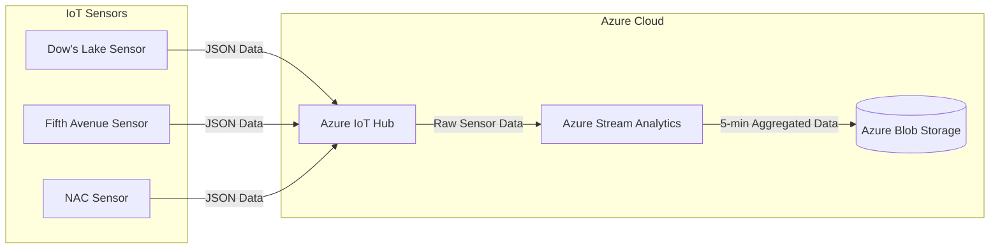

# Rideau Canal Skateway Monitoring

## Scenario Description
The Rideau Canal Skateway, a historic and world-renowned attraction in Ottawa, requires constant monitoring to ensure skater safety. This project provides a real-time data streaming solution using IoT sensors, Azure IoT Hub, Azure Stream Analytics, and Azure Blob Storage. The system simulates telemetry data to detect unsafe ice and weather conditions, processes the data in real-time, and stores results for further analysis.

---

## Architecture Diagram
Below is the system's architecture diagram, illustrating the components and data flow:



## Explanation of the Diagram

- **IoT Devices**: Simulated sensors for the three locations (Dow's Lake, Fifth Avenue, and NAC) send telemetry data every 10 seconds.
- **Azure IoT Hub**: Receives data streams from the simulated sensors.
- **Azure Stream Analytics**: Processes the real-time data, aggregates metrics over a 5-minute tumbling window, and outputs the results.
- **Azure Blob Storage**: Stores the processed data in JSON format for further analysis and historical review.
- **Processed Data Outputs**: Represents the final aggregated data, ready for use.

## Implementation Details

### IoT Sensor Simulation
The `all-in-one-skateway-sensor.py` script simulates IoT sensors at three locations: Dow's Lake, Fifth Avenue, and NAC. Each sensor generates telemetry data every 10 seconds and sends it to Azure IoT Hub.

#### JSON Payload Structure
```json
{
  "location": "Dow's Lake",
  "iceThickness": 27,
  "surfaceTemperature": -1,
  "snowAccumulation": 8,
  "externalTemperature": -4,
  "timestamp": "2024-11-23T12:00:00Z"
}
```

#### Key Features:
- **Multi-location Support**: Sensors simulate telemetry data for three locations.
- **Data Transmission**: Telemetry data is sent to Azure IoT Hub using device-specific connection strings.

---

### Azure IoT Hub Configuration
Steps to configure Azure IoT Hub:
1. Created an IoT Hub in Azure.
2. Registered three devices for Dow's Lake, Fifth Avenue, and NAC.
3. Configured message routing to direct data to Azure Stream Analytics.

---

### Azure Stream Analytics Job
**Input Source**: 
- Data ingestion from Azure IoT Hub.

**SQL Query**:
```sql
SELECT
    location,
    AVG(iceThickness) AS AvgIceThickness,
    MAX(snowAccumulation) AS MaxSnowAccumulation,
    System.Timestamp AS WindowEnd
INTO
    [BlobOutput]
FROM
    [IoTHubInput]
GROUP BY
    location, TumblingWindow(Duration(minute, 5))
```

**Output**: 
- Azure Blob Storage in JSON format.

---

### Azure Blob Storage
The processed data is stored in the following structure:
- **Container Name**: `processed-data`
- **File Format**: JSON
- **File Naming Convention**: `<location>-<timestamp>.json`

---

## Usage Instructions

### 1. Prerequisites
- Python installed on your local machine.
- Azure services: IoT Hub, Stream Analytics, Blob Storage configured.

### 2. Running the IoT Sensor Simulation
1. Clone the repository and navigate to `sensor-simulation/`:
   ```bash
   git clone <repository-url>
   cd sensor-simulation/
   ```
2. Create a `.env` file with the following variables:
   ```plaintext
   DL_CONNECTION_STRING=<Dow's Lake Connection String>
   FA_CONNECTION_STRING=<Fifth Avenue Connection String>
   NAC_CONNECTION_STRING=<NAC Connection String>
   ```
3. Install dependencies:
   ```bash
   pip install -r requirement.txt
   ```
4. Run the script:
   ```bash
   python all-in-one-skateway-sensor.py
   ```

### 3. Configuring Azure Services
1. Set up Azure IoT Hub and register devices.
- **IoT Hub**: Ensure devices for Dow's Lake, Fifth Avenue, and NAC are registered.
2. Configure Azure Stream Analytics job using the provided SQL query.
- **Stream Analytics**: Use the provided SQL query for real-time data processing.
3. Create a Blob Storage container and link it to the Stream Analytics job output.
- **Blob Storage**: Verify that the `processed-data` container is configured.

### 4. Accessing Stored Data
1. Log in to Azure Portal.
2. Navigate to Azure Blob Storage and open the `processed-data` container.
3. Download and view JSON files with aggregated metrics.

---

## Results

### Key Findings
- **Average Ice Thickness**:
  - Dow's Lake: 25.4 cm
  - Fifth Avenue: 26.7 cm
  - NAC: 24.9 cm
- **Maximum Snow Accumulation**:
  - Dow's Lake: 12 cm
  - Fifth Avenue: 14 cm
  - NAC: 11 cm

Sample outputs are available in the `screenshots/` directory.

---

## Reflection

### Challenges
1. **IoT Hub Integration**:
   - Ensuring secure connections using `.env` configuration.
   - Addressed by debugging and testing connection strings.
2. **Stream Analytics Query**:
   - Designing and testing SQL queries for real-time aggregation.
   - Iteratively refined with sample datasets.

### Lessons Learned
- Gained hands-on experience with Azure IoT Hub, Stream Analytics, and Blob Storage.
- Understood the importance of real-time monitoring in safety-critical applications.

---

## Repository Structure
```
.
├── README.md
├── sensor-simulation/
│   ├── all-in-one-skateway-sensor.py
│   ├── .env
│   └── requirements.txt
├── screenshots/
│   ├── architecture_diagram.png
│   ├── iot_hub_configuration.png
│   ├── stream_analytics_settings.png
│   ├── blob_storage_outputs.png
```

---

## License
This project is licensed under the MIT License.
