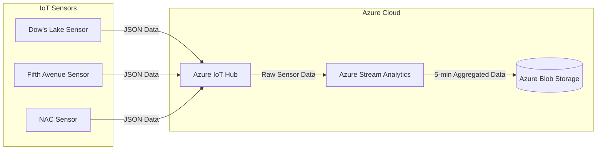

# Rideau Canal Skateway Monitoring

## Scenario Description
The Rideau Canal Skateway, a historic and world-renowned attraction in Ottawa, requires constant monitoring to ensure skater safety. This project provides a real-time data streaming solution using IoT sensors, Azure IoT Hub, Azure Stream Analytics, and Azure Blob Storage. The system simulates telemetry data to detect unsafe ice and weather conditions, processes the data in real-time, and stores results for further analysis.

---

## Architecture Diagram
Below is the system's architecture diagram, illustrating the components and data flow:



## Explanation of the Diagram

- **IoT Devices**: Simulated sensors for the three locations (Dow's Lake, Fifth Avenue, and NAC) send telemetry data every 10 seconds.
- **Azure IoT Hub**: Receives data streams from the simulated sensors.
- **Azure Stream Analytics**: Processes the real-time data, aggregates metrics over a 5-minute tumbling window, and outputs the results.
- **Azure Blob Storage**: Stores the processed data in JSON format for further analysis and historical review.
- **Processed Data Outputs**: Represents the final aggregated data, ready for use.

## Implementation Details

### IoT Sensor Simulation
The `all-in-one-skateway-sensor.py` script simulates IoT sensors at three locations: Dow's Lake, Fifth Avenue, and NAC. Each sensor generates telemetry data every 10 seconds and sends it to Azure IoT Hub.

#### JSON Payload Structure
```json
{
  "location": "Dow's Lake",
  "iceThickness": 27,
  "surfaceTemperature": -1,
  "snowAccumulation": 8,
  "externalTemperature": -4,
  "timestamp": "2024-11-23T12:00:00Z"
}
```

#### Key Features:
- **Multi-location Support**: Sensors simulate telemetry data for three locations.
- **Data Transmission**: Telemetry data is sent to Azure IoT Hub using device-specific connection strings.

---

### Azure IoT Hub Configuration
Steps to configure Azure IoT Hub:
1. Created an IoT Hub in Azure.
2. Registered three devices for Dow's Lake, Fifth Avenue, and NAC.
3. Configured message routing to direct data to Azure Stream Analytics.

---

### Azure Stream Analytics Job
**Input Source**: 
- Data ingestion from Azure IoT Hub.

**SQL Query**:
```sql
SELECT
    location,
    AVG(iceThickness) AS AvgIceThickness,
    MAX(snowAccumulation) AS MaxSnowAccumulation,
    System.Timestamp AS WindowEnd
INTO
    [BlobOutput]
FROM
    [IoTHubInput]
GROUP BY
    location, TumblingWindow(Duration(minute, 5))
```

**Output**: 
- Azure Blob Storage in JSON format.

---

### Azure Blob Storage
The processed data is stored in the following structure:
- **Container Name**: `processed-data`
- **File Format**: JSON
- **File Naming Convention**: `<location>-<timestamp>.json`

---

## Overview of the Python Code

The Python script, `all-in-one-skateway-sensor.py`, is designed to simulate IoT sensors for the Rideau Canal Skateway Monitoring System. The script performs the following tasks:

---

### Purpose

The script generates and sends real-time telemetry data from three key locations along the Rideau Canal:

- **Dow's Lake**
- **Fifth Avenue**
- **NAC**

This data is used to monitor critical factors affecting ice safety, such as ice thickness, surface temperature, snow accumulation, and external temperature.

---

### Functionality

#### 1. **Simulated Telemetry Data Generation**
- The script uses randomized values within predefined ranges to simulate realistic sensor readings.
- Telemetry data includes:
  - **Ice Thickness**: Ranges between 20 cm and 40 cm.
  - **Surface Temperature**: Ranges between -15°C and 0°C.
  - **Snow Accumulation**: Ranges between 5 cm and 20 cm.
  - **External Temperature**: Ranges between -25°C and 5°C.
  - **Timestamp**: The current UTC time when the data is generated.

#### 2. **IoT Hub Integration**
- The script sends telemetry data from each simulated location to Azure IoT Hub.
- Each location is associated with a unique connection string, loaded from a `.env` file for secure and flexible configuration.

#### 3. **Real-Time Data Transmission**
- Data is sent as JSON-formatted messages every 10 seconds for each location.
- Messages are logged to the console for verification.

#### 4. **Graceful Shutdown**
- The script supports interruption (e.g., pressing `Ctrl+C`) and ensures all IoT Hub connections are properly closed when the script is stopped.

---

### Key Features

- **Multi-Device Support**: Simulates telemetry for three separate locations simultaneously.
- **Secure Configuration**: Uses `.env` files to securely store and access connection strings.
- **Real-Time Operation**: Sends data continuously at regular intervals, ensuring real-time monitoring.
- **Easy Customization**: Allows users to adjust the data ranges or transmission interval for their specific use case.

---

### Example Telemetry Data

The telemetry data generated for each location follows this JSON structure:

```json
{
  "location": "Dow's Lake",
  "iceThickness": 27.5,
  "surfaceTemperature": -5.2,
  "snowAccumulation": 12.1,
  "externalTemperature": -10.3,
  "timestamp": "2024-11-23T12:00:00Z"
}
```

---

### How It Fits Into the Project

This Python script acts as the primary data source for the Rideau Canal Skateway Monitoring System. It simulates real-world IoT sensors that:

1. Feed telemetry data to Azure IoT Hub.
2. Enable Azure Stream Analytics to process and aggregate data in real-time.
3. Provide insights into ice and weather conditions for safety analysis.

---

## Code Explanation

### 1. **Importing Required Modules**

```python
import time
import random
import os
from azure.iot.device import IoTHubDeviceClient, Message
from datetime import datetime 
from dotenv import load_dotenv
```

- **`time`**: Controls the frequency of telemetry data transmission (every 10 seconds).
- **`random`**: Generates random values to simulate realistic sensor readings.
- **`os`**: Accesses environment variables (connection strings) stored in a `.env` file.
- **`IoTHubDeviceClient`**: Facilitates communication with Azure IoT Hub.
- **`Message`**: Wraps telemetry data to prepare it for transmission to IoT Hub.
- **`datetime`**: Generates timestamps for the telemetry data in UTC format.
- **`load_dotenv`**: Loads environment variables from a `.env` file for secure configuration.

---

### 2. **Loading Configuration**

```python
load_dotenv()
CONNECTION_STRINGS = {
    "Dow's Lake": os.getenv('DL_CONNECTION_STRING'),
    "Fifth Avenue": os.getenv('FA_CONNECTION_STRING'),
    "NAC": os.getenv('NAC_CONNECTION_STRING')
}
```

- **`.env File`**:
  - Contains device connection strings for the three IoT devices.
  - Example `.env` file:
    ```
    DL_CONNECTION_STRING=your_connection_string_for_dows_lake
    FA_CONNECTION_STRING=your_connection_string_for_fifth_avenue
    NAC_CONNECTION_STRING=your_connection_string_for_nac
    ```
- **`CONNECTION_STRINGS`**:
  - A dictionary mapping each location to its corresponding IoT Hub connection string, enabling secure and dynamic device configuration.

---

### 3. **Simulating Telemetry Data**

```python
def get_telemetry(location):
    return {
        "location": location,
        "iceThickness": random.uniform(20, 40),
        "surfaceTemperature": random.uniform(-15, 0),
        "snowAccumulation": random.uniform(5, 20),
        "externalTemperature": random.uniform(-25, 5),
        "timestamp": datetime.utcnow().isoformat() + "Z"
    }
```

- **`get_telemetry(location)`**:
  - Generates telemetry data for a specified location with random values for:
    - **Ice Thickness**: Random value between 20 cm and 40 cm.
    - **Surface Temperature**: Random value between -15°C and 0°C.
    - **Snow Accumulation**: Random value between 5 cm and 20 cm.
    - **External Temperature**: Random value between -25°C and 5°C.
    - **Timestamp**: Current UTC time in ISO 8601 format.

---

### 4. **Main Function**

```python
def main():
    clients = {
        location: IoTHubDeviceClient.create_from_connection_string(conn_str)
        for location, conn_str in CONNECTION_STRINGS.items()
    }

    print("Sending telemetry to IoT Hub...")
    try:
        while True:
            for location, client in clients.items():
                telemetry = get_telemetry(location)
                message = Message(str(telemetry))
                client.send_message(message)
                print(f"Sent message from {location}: {message}")
            time.sleep(10)
    except KeyboardInterrupt:
        print("Stopped sending messages.")
    finally:
        for client in clients.values():
            client.disconnect()
```

---

#### 4.1 **Creating IoT Hub Clients**

```python
clients = {
    location: IoTHubDeviceClient.create_from_connection_string(conn_str)
    for location, conn_str in CONNECTION_STRINGS.items()
}
```

- Initializes an `IoTHubDeviceClient` instance for each location using its unique connection string.

---

#### 4.2 **Sending Telemetry Data**

```python
while True:
    for location, client in clients.items():
        telemetry = get_telemetry(location)
        message = Message(str(telemetry))
        client.send_message(message)
        print(f"Sent message from {location}: {message}")
    time.sleep(10)
```

- **Infinite Loop**: Continuously sends telemetry data every 10 seconds.
- **Logging**: Prints telemetry data for verification.

---

#### 4.3 **Graceful Shutdown**

```python
except KeyboardInterrupt:
    print("Stopped sending messages.")
finally:
    for client in clients.values():
        client.disconnect()
```

- Ensures proper cleanup by disconnecting all IoT Hub clients when interrupted.

---

### 5. **Entry Point**

```python
if __name__ == "__main__":
    main()
```

- Ensures the script runs only when executed directly.

---

### Summary of the Script

1. Loads secure connection strings from a `.env` file.
2. Simulates telemetry data for three Rideau Canal locations.
3. Sends real-time data to Azure IoT Hub every 10 seconds.
4. Handles interruptions gracefully and cleans up resources.

--- 

## Usage Instructions

### 1. Prerequisites
- Python installed on your local machine.
- Azure services: IoT Hub, Stream Analytics, Blob Storage configured.

### 2. Running the IoT Sensor Simulation
1. Clone the repository and navigate to `sensor-simulation/`:
   ```bash
   git clone <repository-url>
   cd sensor-simulation/
   ```
2. Create a `.env` file with the following variables:
   ```plaintext
   DL_CONNECTION_STRING=<Dow's Lake Connection String>
   FA_CONNECTION_STRING=<Fifth Avenue Connection String>
   NAC_CONNECTION_STRING=<NAC Connection String>
   ```
3. Install dependencies:
   ```bash
   pip install -r requirement.txt
   ```
4. Run the script:
   ```bash
   python all-in-one-skateway-sensor.py
   ```

### 3. Configuring Azure Services
1. Set up Azure IoT Hub and register devices.
- **IoT Hub**: Ensure devices for Dow's Lake, Fifth Avenue, and NAC are registered.
2. Configure Azure Stream Analytics job using the provided SQL query.
- **Stream Analytics**: Use the provided SQL query for real-time data processing.
3. Create a Blob Storage container and link it to the Stream Analytics job output.
- **Blob Storage**: Verify that the `processed-data` container is configured.

### 4. Accessing Stored Data
1. Log in to Azure Portal.
2. Navigate to Azure Blob Storage and open the `processed-data` container.
3. Download and view JSON files with aggregated metrics.

---

## Results

### Key Findings
- **Average Ice Thickness**:
  - Dow's Lake: 25.4 cm
  - Fifth Avenue: 26.7 cm
  - NAC: 24.9 cm
- **Maximum Snow Accumulation**:
  - Dow's Lake: 12 cm
  - Fifth Avenue: 14 cm
  - NAC: 11 cm

Sample outputs are available in the `screenshots/` directory.

---

## Reflection

### Challenges
1. **IoT Hub Integration**:
   - Ensuring secure connections using `.env` configuration.
   - Addressed by debugging and testing connection strings.
2. **Stream Analytics Query**:
   - Designing and testing SQL queries for real-time aggregation.
   - Iteratively refined with sample datasets.

### Lessons Learned
- Gained hands-on experience with Azure IoT Hub, Stream Analytics, and Blob Storage.
- Understood the importance of real-time monitoring in safety-critical applications.

---

## Repository Structure
```
.
├── README.md
├── sensor-simulation/
│   ├── all-in-one-skateway-sensor.py
│   ├── .env
│   └── requirements.txt
├── screenshots/
│   ├── architecture_diagram.png
│   ├── iot_hub_configuration.png
│   ├── stream_analytics_settings.png
│   ├── blob_storage_outputs.png
```

---

## License
This project is licensed under the MIT License.
