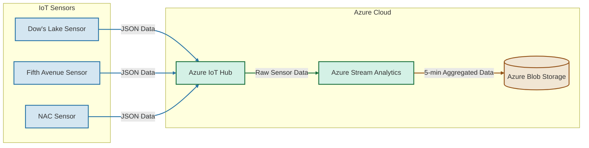

# Rideau Canal Skateway Monitoring
## Architecture Diagram

```mermaid
graph LR
    subgraph "IoT Sensors"
        S1[Dow's Lake Sensor]
        S2[Fifth Avenue Sensor]
        S3[NAC Sensor]
    end

    subgraph "Azure Cloud"
        IH[Azure IoT Hub]
        ASA[Azure Stream Analytics]
        BS[(Azure Blob Storage)]
    end

    %% Sensor data flow to IoT Hub
    S1 -->|JSON Data| IH
    S2 -->|JSON Data| IH
    S3 -->|JSON Data| IH

    %% IoT Hub to Stream Analytics
    IH -->|Raw Sensor Data| ASA

    %% Stream Analytics processing and storage
    ASA -->|5-min Aggregated Data| BS

    %% Add styling
    classDef sensor fill:#D4E6F1,stroke:#2874A6,stroke-width:2px
    classDef azure fill:#D4F1E6,stroke:#196F3D,stroke-width:2px
    classDef storage fill:#F1E6D4,stroke:#935116,stroke-width:2px

    class S1,S2,S3 sensor
    class IH,ASA azure
    class BS storage

    %% Add labels for data types with darker colors
    linkStyle 0,1,2 stroke:#2874A6,stroke-width:2px
    linkStyle 3 stroke:#196F3D,stroke-width:2px
    linkStyle 4 stroke:#935116,stroke-width:2px
```