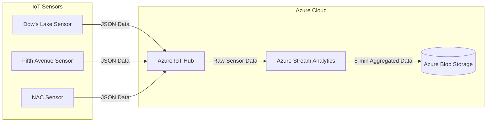

# Rideau Canal Skateway Monitoring
## Scenario: Rideau Canal Skateway Monitoring

The Rideau Canal Skateway, a historic and world-renowned attraction in Ottawa, needs constant monitoring to ensure skater safety. Your team has been hired by the National Capital Commission (NCC) to build a real-time data streaming system that will:

- Simulate IoT sensors to monitor ice conditions and weather factors along the canal.
- Process incoming sensor data to detect unsafe conditions in real time.
- Store the results in Azure Blob Storage for further analysis.
## Architecture Diagram
