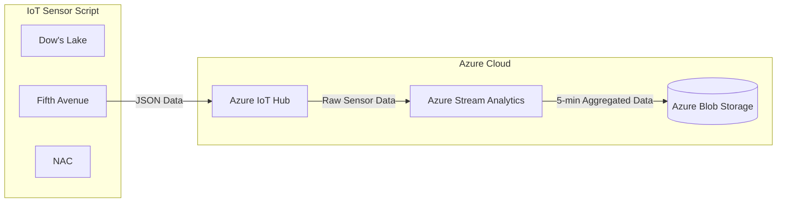

# Rideau Canal Skateway Monitoring

## Scenario: Rideau Canal Skateway Monitoring

The Rideau Canal Skateway, a historic and world-renowned attraction in Ottawa, needs constant monitoring to ensure skater safety. Your team has been hired by the National Capital Commission (NCC) to build a real-time data streaming system that will:

- Simulate IoT sensors to monitor ice conditions and weather factors along the canal.
- Process incoming sensor data to detect unsafe conditions in real time.
- Store the results in Azure Blob Storage for further analysis.

## Architecture Diagram



### Workflow

- **IoT Sensors**: The script simulates sensors at three locations (Dow's Lake, Fifth Avenue, and NAC) send telemetry data every 10 seconds.
- **Azure IoT Hub**: Receives data streams from the simulated sensors.
- **Azure Stream Analytics**: Processes the real-time data, aggregates metrics over a 5-minute tumbling window, and outputs the results.
- **Azure Blob Storage**: Stores the processed data in JSON format for further analysis and historical review.

## Implementation Details

### IoT Sensor Simulation

The all-in-one-skateway-sensor.py script simulates IoT sensors at three locations: Dow's Lake, Fifth Avenue, and NAC. Each sensor generates telemetry data every 10 seconds and sends it to Azure IoT Hub.

The process is broken down into the following steps:

1. **Set Up Connection**:  
   The IoT Hub device connection string is defined for each sensor location. This string is used to authenticate the simulated IoT devices with the Azure IoT Hub instance.

2. **Generate Sensor Data**:  
   A function is defined to generate random values for the sensor data, including ice thickness, surface temperature, snow accumulation, and external temperature. This data is generated every 10 seconds and structured in the following JSON format:

   #### JSON Payload Structure:

   ```json
   {
     "location": "<location>",
     "iceThickness": 27,
     "surfaceTemperature": -1,
     "snowAccumulation": 8,
     "externalTemperature": -4,
     "timestamp": "2024-11-30T12:00:00Z"
   }
   ```

3. **Establish IoT Hub Connection**: Using a loop, establish a connection to an Azure IoT Hub instance from each device.
4. **Prepare Data for Transmission**: In a separate loop, prepare the data to be sent by calling assigning the function to a variable created in step 2.
5. **Prepare Message**: Construct a message that can be sent to IoT Hub.
6. **Send Data**: Each JSON payload is wrapped in a Message object and sent to the IoT Hub.
7. **Repeat**: Continuously sends data every 10 seconds.

### Libraries Used in the Script

- **azure.iot.device**
- **dotenv**
- **datetime**

### Python Script to Simulate Sensor Data

```python
import time
import random
import os
from azure.iot.device import IoTHubDeviceClient, Message
from datetime import datetime
from dotenv import load_dotenv

load_dotenv()

CONNECTION_STRINGS = {
    "Dow's Lake": os.getenv('DL_CONNECTION_STRING'),
    "Fifth Avenue": os.getenv('FA_CONNECTION_STRING'),
    "NAC": os.getenv('NAC_CONNECTION_STRING')
}

def get_telemetry(location):
    return {
        "location": location,
        "iceThickness": random.uniform(20, 40),
        "surfaceTemperature": random.uniform(-15, 0),
        "snowAccumulation": random.uniform(5, 20),
        "externalTemperature": random.uniform(-25, 5),
        "timestamp": datetime.utcnow().isoformat() + "Z"
    }

def main():
    clients = {
        location: IoTHubDeviceClient.create_from_connection_string(conn_str)
        for location, conn_str in CONNECTION_STRINGS.items()
    }

    print("Sending telemetry to IoT Hub...")
    try:
        while True:
            for location, client in clients.items():
                telemetry = get_telemetry(location)
                message = Message(str(telemetry))
                client.send_message(message)
                print(f"Sent message from {location}: {message}")
            time.sleep(10)
    except KeyboardInterrupt:
        print("Stopped sending messages.")
    finally:
        for client in clients.values():
            client.disconnect()

if __name__ == "__main__":
    main()
```

### In Depth Script Explanation

#### 1. **Importing Required Modules**

```python
import time
import random
import os
from azure.iot.device import IoTHubDeviceClient, Message
from datetime import datetime
from dotenv import load_dotenv
```

- **`time`**: Controls the frequency of telemetry data transmission (every 10 seconds).
- **`random`**: Generates random values to simulate realistic sensor readings.
- **`os`**: Accesses environment variables (connection strings) stored in a `.env` file.
- **`IoTHubDeviceClient`**: Facilitates communication with Azure IoT Hub.
- **`Message`**: Wraps telemetry data to prepare it for transmission to IoT Hub.
- **`datetime`**: Generates timestamps for the telemetry data in UTC format.
- **`load_dotenv`**: Loads environment variables from a `.env` file for secure configuration.

---

#### 2. **Loading Configuration**

```python
CONNECTION_STRINGS = {
    "Dow's Lake": os.getenv('DL_CONNECTION_STRING'),
    "Fifth Avenue": os.getenv('FA_CONNECTION_STRING'),
    "NAC": os.getenv('NAC_CONNECTION_STRING')
}
```

- **`CONNECTION_STRINGS`**:
  - A dictionary mapping each location to its corresponding IoT Hub connection string.

---

#### 3. **Telemetry Data**

```python
def get_telemetry(location):
    return {
        "location": location,
        "iceThickness": random.uniform(20, 40),
        "surfaceTemperature": random.uniform(-15, 0),
        "snowAccumulation": random.uniform(5, 20),
        "externalTemperature": random.uniform(-25, 5),
        "timestamp": datetime.utcnow().isoformat() + "Z"
    }
```

- **`get_telemetry(location)`**:
  - Generates telemetry data for a specified location with random values for:
    - **Ice Thickness**: Random value between 20 cm and 40 cm.
    - **Surface Temperature**: Random value between -15°C and 0°C.
    - **Snow Accumulation**: Random value between 5 cm and 20 cm.
    - **External Temperature**: Random value between -25°C and 5°C.
    - **Timestamp**: Current UTC time in ISO 8601 format.

---

#### 4. **Creating IoT Hub Clients**

```python
clients = {
    location: IoTHubDeviceClient.create_from_connection_string(conn_str)
    for location, conn_str in CONNECTION_STRINGS.items()
}
```

- Initializes an `IoTHubDeviceClient` instance for each location using its unique connection string.

---

#### 6. **Sending Telemetry Data**

```python
while True:
    for location, client in clients.items():
        telemetry = get_telemetry(location)
        message = Message(str(telemetry))
        client.send_message(message)
        print(f"Sent message from {location}: {message}")
    time.sleep(10)
```

- **Infinite Loop**: Continuously sends telemetry data every 10 seconds.

---

#### 7. **Graceful Shutdown**

```python
except KeyboardInterrupt:
    print("Stopped sending messages.")
finally:
    for client in clients.values():
        client.disconnect()
```

- Ensures cleanup by disconnecting all IoT Hub clients upon interruption.

---

### Azure IoT Hub Configuration

#### 1. Create the IoT Hub

1.  In the Azure Portal, search for IoT Hub and click Create to create the IoT Hub.
2.  Provide a name, select a resource group, choose a region, and select the Free Tier to keep costs low. Click Review + Create and then Create.

#### 2. Register a Device

1.  Add Device to register a new device. This device is used to send data to the IoT Hub.
2.  Click the device and copy the connection string which will be use in the script.

#### 3. Message routing (Optionally)

1. In the IoT Hub, select 'Message Routing
2. Define the endpoint (Storage) and choose your container
3. Choose a preferred file format and define your file naming convention.
4. Create a route, and add a query to filter data before routing it to the endpoint


### Azure Stream Analytics Job

Azure Stream Analytics is used to process data in real-time by aggregating the data for each location over a 5-minute window, calculating the average ice thickness and maximum snow accumulation. The prcessed data is sent to Azure Blob Storage.

#### 1. **Input Sources**

In the Stream Analytics job, we configure the input source to receive data from the Azure IoT Hub.


#### 2. **Output Sources**

In the Stream Analytics job, configure the output source to write the processed data to **Azure Blob Storage**.


#### 3. **Query Logic**

In the Stream Analytics job, the query logic defines how to process the incoming telemetry data. This query logic aggregates and processes the data based on the specified criteria. Here's the sample query logic for this project:

```sql
SELECT
    IoTHub.ConnectionDeviceId AS DeviceId,
    AVG(iceThickness) AS AvgIceThickness,
    AVG(snowAccumulation) AS AvgSnowAccumulation,
    System.Timestamp AS EventTime
INTO
    [output]
FROM
    [input]
GROUP BY
    IoTHub.ConnectionDeviceId, TumblingWindow(minute, 5)
```

**Explanation**: This query processes streaming data in Azure Stream Analytics. It calculates the average ice thickness and snow accumulation from incoming telemetry data grouped by device ID `(IoTHub.ConnectionDeviceId)` over 5-minute tumbling windows. The results include the device ID, the computed averages for ice thickness and snow accumulation, and the event timestamp (System.Timestamp). The processed data is then written to an output sink specified by output.


### Azure Blob Storage

Processed data from Azure Stream Analytics is stored in Azure Blob Storage. The data, aggregated in 5-minute windows, is automatically sent to the defined container.

The processed data is stored in a container within Azure Blob Storage.

- **Container Name**: iotoutput
- **File Format**: JSON
- **File Naming Convention**: unique naming convention generated by Stream Analytics if not define. We could've set a file format with the following naming concention `output/{date}/{time}`.

Files are updated or replaced during each 5-minute aggregation window, ensuring the most recent calculations are stored.


## Usage Instructions

### 1. Prerequisites

- Python installed on your local machine.
- Azure services: Ensure that IoT Hub (With 3 devices sensor), Stream Analytics, and Blob Storage are configured.

### 2. Running the IoT Sensor Simulation

1. Clone the repository and navigate to the `sensor-simulation/` directory:
   ```bash
   git clone https://github.com/princefelix-23/cst8916-group3-iot.git
   cd sensor-simulation/
   ```
2. Create a .env file in the root directory of the project. Add the device connection strings for each sensor location provided by Azure IoT Hub as follows:
   ```
   DL_CONNECTION_STRING=<device-connection-string>
   FA_CONNECTION_STRING=<device-connection-string>
   NAC_CONNECTION_STRING=<device-connection-string>
   ```
3. Install dependencies:
   ```bash
   pip install -r requirements.txt
   ```
4. Run the script:
   ```bash
   python all-in-one-skateway-sensor.py
   ```
   Once running, you should see output in the terminal indicating telemetry data is being sent to Azure IoT Hub.

### 3. Configuring Azure Services

### IoT Hub

---

#### 1. Create an IoT Hub

1. In the Azure Portal, search for **IoT Hub** and click **Create**.
2. Provide a name for your IoT Hub and select a resource group.
3. Choose the **Free Tier** (if available) for testing purposes and create the IoT Hub.

#### 2. Register a Device

1. In the IoT Hub, go to the **Devices** section and click **Add Device**.
2. Provide a Device ID (e.g., `Sensor1`) and click **Save**.
3. After the device is created, click on it to view the connection string. Copy the connection string for use in the Python script that going to simulate the sensor.

### Stream Analytics Job

---

#### 1. Create the Stream Analytics Job

1. In the Azure Portal, search for Stream Analytics jobs and click Create.
2. Provide a name for your job and select the appropriate resource group.
3. Choose Cloud as the hosting environment and create the job.

#### 2. Define Input

1. In the Stream Analytics job, go to the Inputs section and click Add.
2. Choose IoT Hub as the input source.
3. Provide the following details:
   - IoT Hub Namespace: Select your IoT Hub (Automatically detects).
   - IoT Hub Policy Name: Use the iothubowner policy.
   - Consumer Group: Use $Default or create a new consumer group in your IoT Hub.
   - Serialization Format: Choose JSON.

#### 3. Define Output

1. Go to the Outputs section and click Add.
2. Choose Blob Storage as the output destination.
3. Provide the following details:
   - Storage Account: Select your Azure Storage Account (Automatically detects).
   - Container: Create or choose an existing container for storing results.
   - Path Pattern: Optionally, define a folder structure (e.g., output/{date}/{time}).

#### 4. Write the Stream Analytics Query

Navigate to the Query tab and update the default query with the following:

```sql
SELECT
    IoTHub.ConnectionDeviceId AS DeviceId,
    AVG(iceThickness) AS AvgIceThickness,
    AVG(snowAccumulation) AS AvgSnowAccumulation,
    System.Timestamp AS EventTime
INTO
    [output]
FROM
    [input]
GROUP BY
    IoTHub.ConnectionDeviceId, TumblingWindow(minute, 5)
```

### Accessing Stored Data

---

Check Blob Storage

- Go to your Azure Storage Account.
- Navigate to the container you specified in the output, this case `iotoutput`.
- Verify that processed data is being stored in JSON format.
- Download the json file to view the content and result
- Optionally use SAS token to generate `SAS URL` which can be used to access the file

## Results

### Key Findings

| Interval            | Location     | Average Ice Thickness (cm) | Maximum Snow Accumulation (cm) |
| ------------------- | ------------ | -------------------------- | ------------------------------ |
| **First Interval**  | Dow's Lake   | 39.9                       | 46.0                           |
|                     | Fifth Avenue | 42.3                       | 47.7                           |
|                     | NAC          | 41.3                       | 49.9                           |
| **Second Interval** | Dow's Lake   | 41.6                       | 49.9                           |
|                     | Fifth Avenue | 40.5                       | 49.5                           |
|                     | NAC          | 40.6                       | 48.9                           |

#### Sample output file downloaded from Blob Storage showing three intervals


## Reflection

#### No challenges recorded
